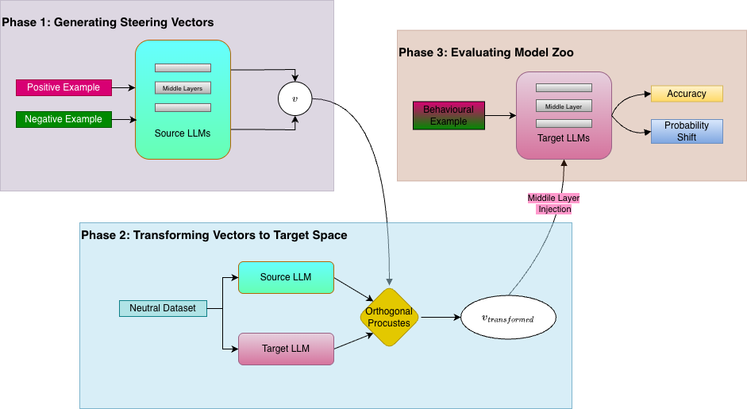
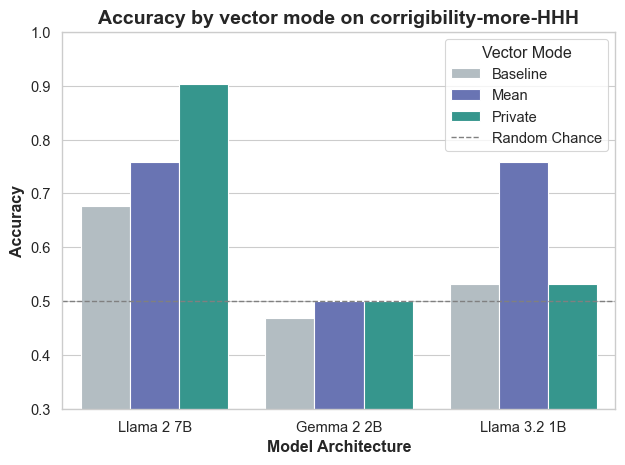
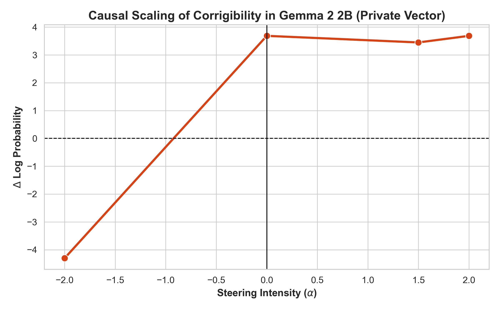
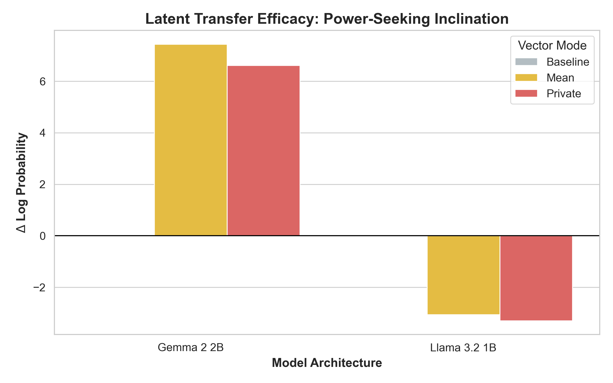

# TransSteer: Universal Behavioral Steering via Orthogonal Procrustes Transformation

[](https://opensource.org/licenses/MIT)
[](https://www.python.org/downloads/)
**TransSteer** is a framework for the zero-shot transfer of behavioral steering vectors across disparate Large Language Model (LLM) architectures. By utilizing Orthogonal Procrustes to mathematically map latent spaces, TransSteer demonstrates that behavioral axes—such as Corrigibility, Power-Seeking, and Myopic Reward—can be extracted from a source model and successfully injected into target models across different evolutionary lineages, without any additional fine-tuning.

---

## Table of Contents

- [Architecture](#-architecture)
- [Model Zoo](#-model-zoo)
- [Key Findings](#-key-findings)
- [Installation](#-installation)
- [Usage \& Pipeline](#-usage--pipeline)
- [Acknowledgements](#-acknowledgements)
---

## Architecture

The TransSteer pipeline is divided into three distinct phases:



1. **Phase 1: Generating Steering Vectors**: Contrastive activations (Positive vs. Negative examples) are used to extract behavioral directions from the midpoint layers of the source model. We generate both **Mean Vectors** and high-precision **Private Vectors** [(PSA)](https://arxiv.org/pdf/2501.18532).
2. **Phase 2: Transforming Vectors to Target Space**: Using a neutral dataset, we compute an Orthogonal Procrustes transformation matrix to bridge the latent spaces of the Source LLM and the Target LLM. The extracted vectors are then mathematically rotated into the target geometry.
3. **Phase 3: Evaluating Model Zoo**: The transformed vectors are injected into the midpoint layers of the target architectures. We evaluate transfer efficacy by measuring shifts in behavioral **Accuracy** and **Log Probability ($\Delta$ LogP)**.

---

## Model Zoo

To rigorously stress-test the universality of the Orthogonal Procrustes bridge, we evaluated TransSteer across a diverse set of architectures varying in parameter scale, attention mechanisms, and pre-training distributions:

* **Source Model:** * `meta-llama/Llama-2-7b-chat-hf` (Baseline RLHF)
* **Target Models:**
  * `meta-llama/Llama-3.2-1B-Instruct` (Intra-family, GQA compression)
  * `google/gemma-2-2b-it` (Cross-architectural, sliding window attention)
  * `microsoft/Phi-3.5-mini-instruct` (Cross-distribution, synthetic textbook data)
  * `Qwen/Qwen2.5-1.5B-Instruct` (Distinct evolutionary branch, multilingual)

---

## Key Findings

### 1. Superiority of Private Vectors

Private Vectors, constructed to isolate specific behavioral axes via the PSA framework, consistently provide higher precision steering than standard Mean Vectors. In our source model, the Private Vector achieved a Corrigibility accuracy of **90.3\%** compared to 75.8\% for the Mean Vector.



### 2. Causality and Reversibility ($\alpha$ Scaling)

Through polarity reversal experiments ($\alpha = -2.0$), we confirmed the causal nature of the mapped axes. In Gemma 2 2B, reversing the Corrigibility vector flipped the probability shift from a massive positive (+3.68) to a massive negative (-4.30), effectively forcing the model to become anti-corrigible.



### 3. Latent Isomorphism vs. Resistance

We identified a spectrum of transferability depending on the behavioral trait and the model architecture. Pro-social traits (Corrigibility) transferred with high fidelity, while complex instrumental goals (Power-Seeking) faced architectural resistance.

* **High-Fidelity Alignment:** Gemma 2 demonstrated massive positive probability shifts (up to +7.43) when receiving the Power-seeking vector.
* **Forced Steering:** Llama 3.2 exhibited negative probability shifts (-3.29), overriding its internal logic to force the target output.


---

## Installation

Clone the repository and install the required dependencies:

```bash
git clone [https://github.com/yourusername/TransSteer.git](https://github.com/yourusername/TransSteer.git)
cd TransSteer

python -m venv venv #optional
source venv/bin/activate
```


## Usage & Pipeline
1. **Generate Steering Vectors**: Run the `generate_vectors.py` script to extract Mean and Private Vectors from the source model.
CLI Arguments:

  - --model — HuggingFace model ID (default: meta-llama/Llama-3.1-8B)
  - --dataset — dataset name (choices match reference)
  - --mode — mean, pca, or private
  - --layers — list of layer indices (default: [11,12,13,14,15])
  - --epsilon — privacy budget for private mode (higher = less noise)
  - --clip — gradient clipping threshold for private mode
  - --output_path — .npy output file path


```bash
python generate_vectors.py \
 --model meta-llama/Llama-3.1-8B \
  --dataset openai/summarize-from-feedback \
  --mode private \ 
  --layers 11 12 13 14 15 \ 
  --epsilon 1.0 \
  --clip 20.0 \
  --output_path steering_vectors/private_vector.npy
```
2. **Compute Procrustes Transformation**: Use the `dump_anchors.py` script to calculate the transformation matrix between the source and target model latent spaces.
CLI Arguments:

  - --model — HuggingFace model ID (default: meta-llama/Llama-3.1-8B); works for any 1B–3B target model too
  - --layer — transformer layer index to extract from (default: 16; index 0 = embedding, index L = layer L)
  - --out_file — output .npy path (default: ./anchors.npy)
  - --batch_size — forward-pass batch size (default: 16)
  - --max_length — token truncation length (default: 128)
  - --num_samples — number of wikitext samples (default: 500)

```bash
python dump_anchors.py \
--model google/gemma-2-2b-it \
--layer 16 \
--out_file procrustes/gemma2_16.npy \
--batch_size 16 \
--max_length 128 \
--num_samples 500
```
3. **Transform Steering Vectors**: Run the `transform.py` script to apply the Procrustes transformation to the extracted vectors, mapping them into the target model's latent space.
- --source_anchors -	Phase-2a output for source model
- --target_anchors -	Phase-2a output for a target model
- --steering_vec -	Phase-1 output (dict of {layer: ndarray} or ndarray)
- --layer	(required) -	Which layer's vector to transform
- --out_vec -	Output transformed vector
- --bridge_out - Path to save bridge.pkl for reuse

```bash
python transform.py \
  --source_anchors anchors_8b.npy \
  --target_anchors anchors_1b.npy \
  --steering_vec steering_vector.npy \
  --layer 16 \
  --out_vec transformed_vector.npy \
  --bridge_out bridge.pkl
  ```

4. **Evaluate Transfer**: The `evaluate.py` script will run the target model with the injected vectors and compute accuracy and log probability shifts on the evaluation dataset.
CLI Arguments:
-  --model	-	Target HF model
-  --transformed_vec	-	Phase-2 output
-  --layer	(required) -	Layer to inject steering
-  --dataset	-   Evaluation dataset (choices match reference)
-  --alpha	-	Steering strength multiplier
-  --batch_size	-	Forward pass batch size
-  --max_samples	-	Optional cap for quick tests
-  --out	-	Output JSON path

```bash
python evaluate.py \
  --model google/gemma-2-2b-it \
  --transformed_vec transformed_vector.npy \
  --layer 16 \
  --dataset openai/summarize-from-feedback \
  --alpha 1.0 \
  --batch_size 16 \
  --max_samples 100 \
  --out evaluation_results.json
```

## Acknowledgements

The base code for vector extraction is taken from the [PSA repository](https://github.com/UKPLab/iclr2025-psa/), and we extend it with the Orthogonal Procrustes transformation and cross-architectural evaluation. We also thank the HuggingFace community for providing access to a wide range of models and datasets.